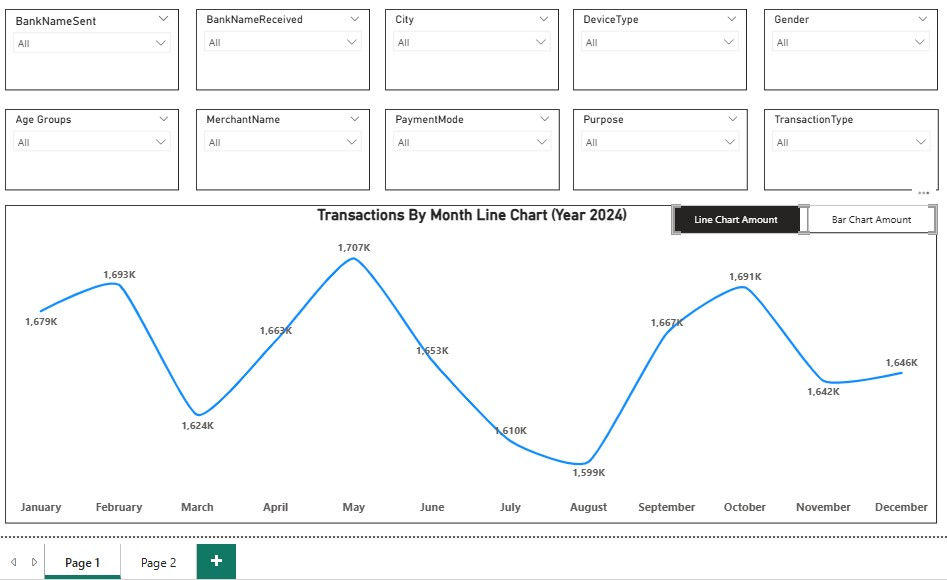
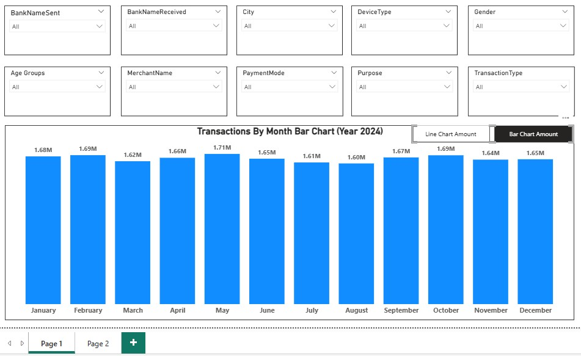
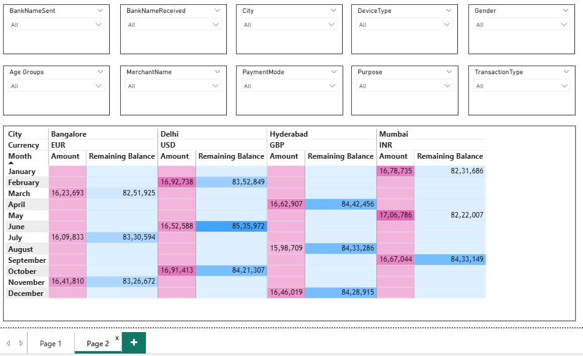

# 📊 UPI Transactions Analysis Dashboard (Power BI)

## 📌 Project Overview
Developed an interactive Power BI dashboard to analyze UPI transaction data for the year 2024 using 20,000+ records. The project focuses on identifying transaction trends, city-wise performance, and remaining balances through dynamic and user-friendly visualizations.

---

## 🛠️ Tools & Technologies
- Power BI  
- Power Query  
- DAX  
- Excel  

---

## 🎯 Key Features
- Interactive dashboard with dynamic filtering  
- Monthly transaction trend analysis  
- City-wise transaction amount and remaining balance  
- Multi-page navigation with synchronized slicers  
- Conditional formatting for better data visualization  
- Bookmark functionality to switch between visuals  

---

## 🔑 Key Tasks Performed (Major Work)

1. Loaded and transformed UPI transaction data from Excel into Power BI  
2. Performed data cleaning and preprocessing using Power Query  
3. Converted data types and split columns for better structure  
4. Conducted data profiling to ensure data quality and consistency  
5. Created calculated columns using DAX (age group segmentation)  
6. Designed line charts to analyze monthly transaction trends  
7. Built bar charts and matrix visuals for city-wise analysis  
8. Applied conditional formatting in matrix visuals for better insights  
9. Implemented slicers and synchronized them across multiple pages  
10. Used bookmarks to enable switching between line and bar charts  

---

## 📊 Dashboard Insights
- Identified peak transaction months in 2024  
- Compared transaction volumes across different cities  
- Analyzed remaining balance trends over time  
- Enabled dynamic filtering for deeper analysis  

---

## 📸 Dashboard Preview

---

## 📂 Project Files
- UPI_Transactions_Dashboard.pbix  

---

## 🚀 How to Use
1. Download the `.pbix` file  
2. Open in Power BI Desktop  
3. Interact with slicers and visuals  

---

## 👨‍💻 Author
Aniket Pawar
